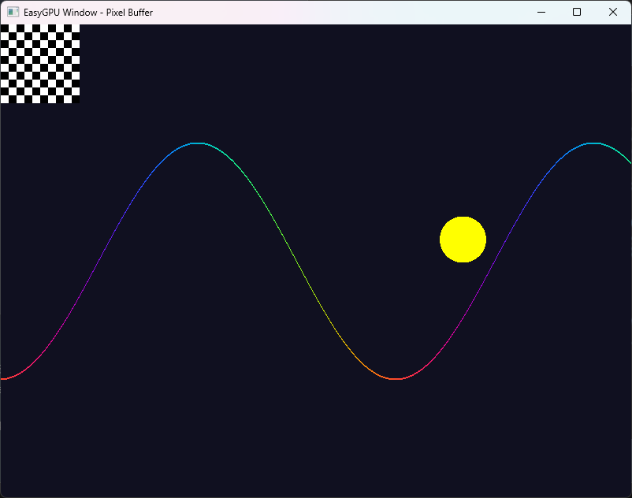
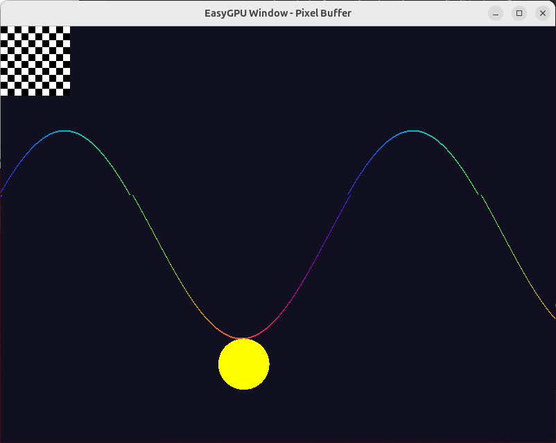

 <div align="center">


# EasyGPU

C++20 Embedded DSL for GPU Compute, Autograd & Neural Networks

[](LICENSE)
[](https://en.cppreference.com/w/cpp/20)
[](https://www.opengl.org/)
[](https://www.vulkan.org/)
[]()
[](docs/autodiff.md)

[Getting Started](docs/getting-started.md) · [Tutorial](docs/tutorial.md) · [Examples](#examples) · [API Reference](docs/api-reference.md)

</div>

---

## Table of Contents

- [Overview](#overview)
- [Concept](#concept)
- [Features](#features)
  - [Automatic Differentiation](#automatic-differentiation--gpu-gradients-zero-hand-written-math)
  - [Neural Network Training](#neural-network-training--tensor--optimizer)
- [Quick Start](#quick-start)
- [Examples](#examples)
- [Best Practices](#best-practices)
- [Documentation](#documentation)
- [Building](#building)
- [License](#license)

---

## Overview

EasyGPU is an embedded domain-specific language (eDSL) for GPU programming that allows writing compute kernels in standard C++20. No shader language knowledge required.

EasyGPU now ships with **reverse-mode automatic differentiation** — write your forward pass once and get GPU gradients for free. No hand-written derivatives, no dual-codebase synchronization. Train models, fit curves, and solve inverse problems entirely on the GPU.

The same DSL runs on both an OpenGL compute backend and a Vulkan compute backend, so you can target a lightweight OpenGL path or a modern Vulkan path without changing a line of kernel code.

```cpp
#include <GPU.h>

int main() {
    std::vector<float> data(1024, 2.0f);
    Buffer<float> input(data);
    Buffer<float> output(1024);

    Kernel1D square([](Int i) {
        auto in = input.Bind();
        auto out = output.Bind();
        out[i] = in[i] * in[i];
    });

    square.Dispatch(16, true);
    return 0;
}
```

### Who Is This For

**For beginners learning GPU programming:**
- Write GPU kernels using familiar C++ syntax instead of learning GLSL/HLSL
- No graphics programming background required — works with arrays, not just triangles
- Full IDE support: autocomplete, type checking, compile-time error detection
- 10 lines of code for your first working GPU kernel

**For ML practitioners and researchers:**
- Reverse-mode autograd that runs entirely on the GPU — no Python required
- Record the forward pass in C++, get combined forward+backward GLSL automatically
- 30+ differentiable intrinsics (sin, cos, exp, log, pow, sqrt...), vector ops, control flow
- Train tiny models, fit curves, and compute gradients without leaving C++

**For experienced developers:**
- Zero vendor lock-in (OpenGL 4.3+ or Vulkan 1.1+, cross-platform)
- Minimal dependencies (only GLAD, ~500KB)
- Clean C++20 interface without heavy template metaprogramming
- First-class Vulkan backend for compute workloads, profiling, textures, uniforms, and descriptor-backed resource binding

### Requirements

- C++20 compatible compiler (GCC 11+, Clang 14+, MSVC 2022+)
- OpenGL 4.3+ or Vulkan 1.1+
- CMake 3.21+ (optional)
- **Windows:** No additional dependencies
- **Linux:** X11 development libraries (`libx11-dev` on Ubuntu/Debian)
- **Vulkan builds:** Vulkan SDK with `glslang` / `SPIRV-Tools` libraries available to CMake

---

## Concept

### The Problem

Traditional GPU programming requires maintaining two separate codebases:

```cpp
// CPU: C++
std::vector<float> data = {1, 2, 3, 4, 5};

// GPU: GLSL (separate language)
const char* shader = R"(
    #version 430 core
    layout(local_size_x = 256) in;
    layout(std430, binding = 0) buffer Data { float values[]; };
    void main() {
        uint idx = gl_GlobalInvocationID.x;
        values[idx] = values[idx] * values[idx];
    }
)";
```

Issues: language fragmentation, no IDE support, runtime error detection, string-based data passing.

### The Approach

EasyGPU unifies both sides in C++:

```cpp
// CPU and GPU: C++
std::vector<float> data = {1, 2, 3, 4, 5};
Buffer<float> input(data);
Buffer<float> output(data.size());

Kernel1D square([](Int i) {
    auto in = input.Bind();
    auto out = output.Bind();
    out[i] = in[i] * in[i];
});

square.Dispatch(16, true);
```

### Implementation

1. User writes C++ kernels using EasyGPU types
2. Library constructs an Intermediate Representation (IR)
3. IR is compiled to GLSL compute shaders
4. OpenGL or Vulkan executes on GPU

---

## Features

### Cross-Platform Support

Runs natively on Windows and Linux with zero code changes. The same kernel code works identically across platforms.

| Platform | Compute Kernels | Fragment Kernels | Backend |
|:---------|:---------------|:-----------------|:--------|
| **Windows** | ✅ Full support | ✅ Full support | WGL |
| **Linux** | ✅ Full support | — | GLX |

```cpp
// This code runs identically on Windows and Linux
Kernel1D transform([](Int i) {
    data[i] = Sqrt(data[i] * 2.0f);
});
transform.Dispatch(16, true);
```

### Dual Backends

EasyGPU now supports two compute backends:

- **OpenGL** — Minimal setup, excellent for teaching, rapid iteration, and existing GL applications
- **Vulkan** — Modern compute backend with explicit resource binding, push-constant uniforms, storage textures, sampled textures, profiler queries, and stronger long-term scalability

This is one of EasyGPU's biggest practical advantages: you keep the same C++ DSL, the same buffer and texture abstractions, and the same kernel code while switching the backend at CMake configure time.

```cmake
cmake -S . -B build_gl -DEASYGPU_BACKEND=OpenGL
cmake -S . -B build_vk -DEASYGPU_BACKEND=Vulkan
```

For projects that want a simple on-ramp, OpenGL remains a great default. For projects that want a modern compute stack, Vulkan is now a first-class path rather than an experimental branch.

### Automatic Differentiation — GPU Gradients, Zero Hand-Written Math

EasyGPU's reverse-mode autograd records every operation during the forward pass and generates the backward pass automatically. The forward and backward passes are merged into a single GPU shader — one dispatch computes both your loss and its gradients. No dual-codebase synchronization, no hand-derived adjoints, no context switching between C++ and GLSL.

**Three API levels for different needs:**

| API | Use Case | GPU Execution |
|:----|:---------|:--------------|
| `AdjointInspector1D` | Inspect generated backward GLSL | Offline only |
| `AdjointKernel1D` | Get combined forward+backward shader | Compile, no built-in training |
| `ADKernel1D` | End-to-end GPU training | Dispatch, download gradients, update |

**Quick example — linear regression in 20 lines:**

```cpp
#include <GPU.h>

// y = w*x + b,  fit to noisy data
ADKernel1D model([&](Int &id) {
    auto x_ref = buf_x.Bind();
    auto y_ref = buf_y.Bind();

    Float w, b;
    w = Param(W_ref[0]);    // trainable weight
    b = Param(W_ref[1]);    // trainable bias

    Float x = x_ref[id];
    Float y_pred = w * x + b;
    Float diff = y_pred - y_ref[id];
    Float loss = diff * diff;

    Loss(loss);
}, N);

// One call = forward + backward + gradient download
model.Backward(groups, true);
auto grad_w = model.Gradient(0);  // ∂loss/∂w
auto grad_b = model.Gradient(1);  // ∂loss/∂b
```

**What makes it work:**

1. **Gradient tape** — Every `+`, `*`, `Exp()`, `Max()`, `Sin()`... is recorded during the forward pass
2. **Adjoint generation** — The tape is walked backwards, applying the chain rule to emit adjoint GLSL
3. **Combined shader** — Forward and backward code are merged into a single compute shader; gradients flow directly into SSBOs
4. **Zero-copy gradient download** — `ADKernel1D::Gradient(p)` maps the GPU gradient buffer for CPU readback

**30+ differentiable operations, out of the box:**

| Category | Operations |
|:---------|:-----------|
| Arithmetic | `+`, `-`, `*`, `/` |
| Transcendental | `Sin`, `Cos`, `Tan`, `Exp`, `Log`, `Pow`, `Sqrt`, `Abs`, `Floor`, `Ceil`, `Round` |
| Trigonometry | `Asin`, `Acos`, `Atan`, `Sinh`, `Cosh`, `Tanh` |
| Vector | `Dot`, `Cross`, `Length`, `Normalize`, `Distance`, `Reflect`, `Refract` |
| Activation | `Max` (ReLU), `Clamp`, `Smoothstep`, `Step`, `Sign` |
| Control flow | `If`/`Else`, `For` loops — gradients flow through branches correctly |

**Callables are differentiable too:**

```cpp
Callable<Float(Float)> Sigmoid = [](Float &x) {
    Return(MakeFloat(1.0f) / (MakeFloat(1.0f) + Exp(-x)));
};

// Use inside AD kernel — gradient flows through the Callable automatically
Float activation = Sigmoid(logits);
```

**Real example — GPT Name Generator & Poetry Transformer:**

A character-level GPT (TransformerBlock + CausalSelfAttention) that trains entirely on GPU through the EasyGPU AD engine. Two demos ship with the project:

- **Name Generator** (`ad_gpt_demo`) — 1-layer transformer (16-dim, 4 heads, ~7K params) on Karpathy's `names.txt` dataset (~32K names). Learns to generate novel names character by character. Full training loop: Tensor, Adam optimizer, gradient buffer sharing, CPU inference.

- **Poetry Generator** (`ad_gpt_poet_demo`) — Same architecture on an embedded Shakespeare sonnet corpus. 16-dim embeddings, 4 heads, vocab size 36. Continuous-text language modeling with checkpoint save/load.

Zero hand-written derivatives. The AD engine generates all backward-pass GLSL from the forward DSL, merges both passes into a single compute shader, and writes per-parameter gradients directly to shared SSBOs. See [`examples/ad_gpt_demo/`](examples/ad_gpt_demo/main.cpp) and [`examples/ad_gpt_poet_demo/`](examples/ad_gpt_poet_demo/main.cpp).

[Learn AD from scratch →](docs/autodiff.md) · [AD API Reference →](docs/api-reference.md#automatic-differentiation)

### Neural Network Training — Tensor + Optimizer

Building on the AD engine, EasyGPU provides a full NN training stack: compile-time-shaped tensors, built-in optimizers, and composable layers — all running through the same AD kernel.

**Three pillars of NN training in EasyGPU:**

| Component | Purpose | API |
|:----------|:--------|:----|
| `Tensor<T, Dims...>` | Multi-dimensional weight containers with CPU/GPU sync | `.Bind()`, `.ForEachParam()`, `.Upload()`, `.Download()` |
| `Adam` / `SGD` / `RMSprop` | Optimizers with weight decay, gradient clipping | `.AddTensor(t)`, `.Step(kernel)` |
| Layers | Reusable building blocks (Linear, Attention, Transformer...) | `.Setup()`, `.Forward(...)` |

**Full GPT training in under 70 lines:**

```cpp
#include <GPU.h>
#include <NN/NN.h>
using namespace GPU::NN;

// Model components
TokenEmbedding<float, 27, 16>     tokEmb;
PositionalEmbedding<float, 16, 16> posEmb;
TransformerBlock<float, 16, 16, 4> transformer(batchSize);
Tensor<float, 27, 16>             lmHead;

// Adam optimizer — registers all parameters in 6 lines
Adam adam(0.001f, 0.85f, 0.99f);
adam.AddTensor(tokEmb.Weight());
adam.AddTensor(posEmb.Weight());
adam.AddTensor(transformer.Attention().Weights());
adam.AddTensor(transformer.FC1());
adam.AddTensor(transformer.FC2());
adam.AddTensor(lmHead);

// AD kernel with 4192 parameters
ADKernel1D kernel([&](Var<int> &batchIdx) {
    // ... forward pass: embeddings → attention → MLP → logits → loss
    AD::Loss(totalLoss);
}, batchSize);

// Training loop — 3 lines per step
for (int step = 0; step < 5000; step++) {
    kernel.Forward(groups, true);
    kernel.Backward(groups, true);
    adam.Step(kernel);  // download gradients, update weights, upload
}
```

**Key design decisions:**
- **Tensor `ForEachParam()`** compiles down to per-element `AD::Param()` calls — no manual index bookkeeping
- **Adam `Step()`** calls `DownloadAllGradients()`, averages per-thread gradients, applies Adam update per scalar, and uploads — all in one call
- **Gradient buffer sharing** packs all parameters from one source buffer into an interleaved gradient SSBO, staying within `GL_MAX_COMPUTE_SHADER_STORAGE_BLOCKS`
- **Layers are purely structural** — no virtual dispatch, no runtime graph. `Setup()` registers parameters, `Forward()` emits DSL code. The compiler inlines everything.

See [`ad_gpt_demo`](examples/ad_gpt_demo/main.cpp) for a full name-generating transformer and [`ad_gpt_poet_demo`](examples/ad_gpt_poet_demo/main.cpp) for poetry generation.

[NN API Reference →](docs/api-reference.md#neural-network)

### Unified Language

Standard C++ syntax for GPU code. IDE features (autocomplete, refactoring, static analysis) work out of the box.

```cpp
Kernel1D sum([](Int i) {
    c[i] = a[i] + b[i];
});
```

### Interoperability — Works with Your Favorite Framework

EasyGPU integrates seamlessly with any OpenGL-based windowing framework. You control the window lifecycle; EasyGPU handles the GPU compute.

| Framework | Use Case | Demo |
|-----------|----------|------|
| **EasyX** | Teaching / Rapid prototyping |  |
| **GLFW** | Cross-platform applications |  |

*Original shader: [Seascape](https://www.shadertoy.com/view/Ms2SD1) on Shadertoy*

Key benefits:
- **Zero windowing interference** — Bring your own window, EasyGPU only touches the GPU
- **Native OpenGL interop** — Render compute results directly to window textures
- **Non-intrusive design** — Adopt incrementally in existing projects

### Control Flow

Structured control flow with C++-like semantics:

```cpp
If(x > 0, [&]() { 
    result = Sqrt(x); 
}).Else([&]() { 
    result = 0; 
});

For(0, 100, [&](Int& i) {
    If(i % 2 == 0) { Continue(); }
    Process(i);
});
```

### Shared Memory & Atomics

High-performance workgroup-level cooperation with shared memory and atomic operations:

```cpp
// Parallel reduction using shared memory
SharedMemory<float, 256> shared;

Kernel1D reduce([](Int i) {
    // Each thread contributes one value
    Expr<float> myValue = input[i];
    
    // Reduce across all threads in workgroup
    Expr<float> sum = WorkgroupReduce(shared, myValue);
    
    // Thread 0 writes result
    Int localId = LocalThreadId();
    If(localId == 0, [&]() {
        output[WorkgroupId()] = sum;
    });
}, 256);
```

Atomic operations for thread-safe counters and histograms:

```cpp
Kernel1D histogram([](Int i) {
    auto hist = histogram.Bind();
    Int bin = ComputeBin(input[i]);
    
    // Atomic increment
    ExprBase::NotUse(AtomicAdd(hist[bin], MakeInt(1)));
});
```

**Features:**
- **SharedMemory** — Fast workgroup-local storage (~1-10 cycles vs ~100s for global memory)
- **Atomic Operations** — AtomicAdd, AtomicMin, AtomicMax, AtomicAnd, AtomicOr, AtomicXor, AtomicExchange, AtomicCompSwap
- **Parallel Primitives** — WorkgroupReduce, WorkgroupScanInclusive, WorkgroupScanExclusive
- **Barriers** — WorkgroupBarrier, MemoryBarrier, FullBarrier for synchronization

See [Parallel Primitives Guide](docs/parallel-primitives.md) for detailed documentation.

### Memory Management

Automatic buffer alignment and struct layout:

```cpp
EASYGPU_STRUCT(Particle,
    (Float3, position),
    (Float3, velocity),
    (float, mass)
);

Buffer<Particle> particles(1000);
```

> **Important:** `EASYGPU_STRUCT` must be defined in the **global namespace**. Defining it inside any namespace will cause compilation errors.
> 
> ```cpp
> // Correct: global namespace
> EASYGPU_STRUCT(Particle, ...);
> 
> // Wrong: inside namespace
> namespace MyProject {
>     EASYGPU_STRUCT(Particle, ...);  // ERROR
> }
> ```

### Reusable Functions

```cpp
Callable<Float(Float)> square = [](Float x) {
    Return(x * x);
};

result = square(input);
```

**Generic Callables with Templates:**

```cpp
// Works with any GPU types (Int, Float, Float2, etc.)
template <class T1, class T2>
Callable<Float(T1, T2)> weightedSum = [&](T1 a, T2 b) {
    Return(ToFloat(a) * 0.7f + ToFloat(b) * 0.3f);
};

// Mix Int and Float seamlessly
Float result = weightedSum<Int, Float>(MakeInt(100), MakeFloat(0.5f));
```

**Header-Defined Callables (Multi-File Projects):**

When defining Callables in header files, add `inline` to prevent linker errors:

```cpp
// In header file (.h)
inline Callable<Float(Float, Float)> IntensityToColor = [](Float intensity, Float scale) {
    Return(intensity * scale);
};
```

### Introspection

```cpp
// Inspect generated GLSL
std::cout << kernel.GetGeneratedGLSL() << std::endl;

// Profile execution
KernelProfiler::PrintReport(kernel);
```

### Built-in Cross-Platform Window

EasyGPU includes a lightweight, cross-platform window component for interactive GPU compute visualization. Built on top of [minifb](https://github.com/emoon/minifb), it provides a minimal footprint alternative to heavyweight frameworks like GLFW or SDL — the entire windowing layer adds less than 100KB to your binary.

**Zero external dependencies.** The window component is self-contained and compiles out-of-the-box on both Windows and Linux. No need to hunt for system libraries or deal with complex linker flags.

| Windows | Ubuntu |
|:-------:|:------:|
|  |  |

```cpp
#include <GPU.h>

int main() {
    // Create a lightweight window
    AppWindow window({
        .width = 1024,
        .height = 768,
        .title = "EasyGPU Real-time Compute"
    });
    
    // Create GPU texture and presenter
    Texture2D<PixelFormat::RGBA8> texture(1024, 768);
    TexturePresenter presenter(window);
    
    // Render kernel
    Kernel2D render([&](Int x, Int y) {
        auto tex = texture.Bind();
        tex.Write(x, y, MakeFloat4(ToFloat(x) / 1024, ToFloat(y) / 768, 0.0f, 1.0f));
    });
    
    // Real-time loop
    while (window.IsOpen()) {
        window.PollEvents();
        render.Dispatch(64, 48);
        presenter.Present(texture);  // Display GPU result
    }
}
```

**Key Features:**
- **Ultra-lightweight** — Based on minifb, minimal overhead (~100KB added)
- **Truly cross-platform** — Identical API on Windows (Win32) and Linux (X11)
- **Zero external dependencies** — Self-contained, header-friendly implementation
- **Event-driven input** — Keyboard, mouse, and resize events
- **Dual rendering paths** — CPU `PixelBuffer` for software rendering, `TexturePresenter` for direct GPU display
- **Optional at build time** — Control via `EASYGPU_BUILD_WINDOW` CMake option

[Learn more about Window API →](docs/window.md)

### Async Data Transfer

Pixel Buffer Objects (PBO) for non-blocking CPU/GPU transfers:

```cpp
Texture2D<PixelFormat::RGBA8> video(1920, 1080);
video.InitUploadPBOPool(2);  // Double buffering

// Upload without blocking - essential for real-time video
video.UploadAsync(frameData.data());
kernel.Dispatch(120, 68, true);  // GPU processes while CPU continues
```

### Shader Binary Cache

Automatic in-memory caching of compiled GPU programs for faster kernel execution:

```cpp
Kernel1D kernel([](Int i) {
    data[i] = data[i] * 2.0f;
});

// First dispatch: compiles and caches (~15ms)
kernel.Dispatch(16, true);

// Subsequent dispatches: uses cached binary (~0.5ms)
kernel.Dispatch(16, true);
```

**Key Features:**
- **Zero configuration** — Works automatically, no code changes needed
- **Cross-backend** — Supports both OpenGL and Vulkan
- **In-memory only** — No disk I/O, cache cleared on exit
- **Thread-safe** — Safe for multi-threaded applications

[Learn more about Shader Cache →](docs/shader-cache.md)

### Performance Notes — Exclusive OpenGL Context Mode

EasyGPU operates in **exclusive mode** by default, assuming it has sole ownership of the OpenGL context within the current thread. This design choice maximizes performance by:

- **State caching**: Programs, buffers, and textures are only rebound when actually changed
- **Eliminating redundant `glMakeCurrent`**: Context is made current once during `Attach()` and stays current
- **No defensive `glGet` calls**: Trusting cached state avoids expensive driver synchronization

**Implications:**
- Do not interleave raw OpenGL calls with EasyGPU operations in the same context
- If you must use raw OpenGL, either:
  - Use a separate OpenGL context, or
  - Call `GPU::Runtime::GetStateCache().Invalidate()` before returning to EasyGPU

**FragmentKernel Lifecycle:**
```cpp
FragmentKernel2D kernel(...);
kernel.Attach(hwnd);  // Context becomes current here

while (running) {
    // No need to MakeCurrent - context stays current
    kernel.Flush();     // Minimal state changes thanks to caching
}
// Context cleanup happens automatically
```

---

## Quick Start

### Installation

**CMake FetchContent:**

```cmake
include(FetchContent)
FetchContent_Declare(
    easygpu
    GIT_REPOSITORY https://github.com/easygpu/EasyGPU.git
    GIT_TAG v0.2.0
)
FetchContent_MakeAvailable(easygpu)
target_link_libraries(your_target EasyGPU)
```

To build EasyGPU itself with the Vulkan backend:

```cmake
set(EASYGPU_BACKEND Vulkan CACHE STRING "" FORCE)
```

Or from the command line:

```bash
cmake -S . -B build -DEASYGPU_BACKEND=Vulkan
```

If you want OpenGL explicitly:

```bash
cmake -S . -B build -DEASYGPU_BACKEND=OpenGL
```

**Manual:** Copy `include/` to your project and link against OpenGL.

### Using EasyGPU in Your Own CMake Project

If you embed EasyGPU via `FetchContent`, you can select the backend before `FetchContent_MakeAvailable`:

```cmake
include(FetchContent)

set(EASYGPU_BACKEND Vulkan CACHE STRING "EasyGPU backend" FORCE)
set(EASYGPU_BUILD_TESTS OFF CACHE BOOL "" FORCE)
set(EASYGPU_BUILD_EXAMPLES OFF CACHE BOOL "" FORCE)
set(EASYGPU_BUILD_FRAGMENT_TESTER OFF CACHE BOOL "" FORCE)

FetchContent_Declare(
    easygpu
    GIT_REPOSITORY https://github.com/easygpu/EasyGPU.git
    GIT_TAG v0.2.0
)
FetchContent_MakeAvailable(easygpu)

target_link_libraries(your_target PRIVATE EasyGPU)
```

To switch back to OpenGL in your own project, change only one line:

```cmake
set(EASYGPU_BACKEND OpenGL CACHE STRING "EasyGPU backend" FORCE)
```

No kernel rewrite is required.

### First Program

```cpp
#include <GPU.h>
#include <iostream>
#include <vector>

int main() {
    std::vector<float> numbers = {1, 2, 3, 4, 5};
    
    Buffer<float> gpu_input(numbers);
    Buffer<float> gpu_output(numbers.size());
    
    Kernel1D double_values([&](Int i) {
        auto input = gpu_input.Bind();
        auto output = gpu_output.Bind();
        output[i] = input[i] * 2.0f;
    });
    
    double_values.Dispatch(1, true);
    gpu_output.Download(numbers);
    
    for (float n : numbers) {
        std::cout << n << " ";
    }
    
    return 0;
}
```

> ⚠️ **Important: Variable Initialization**
> 
> Always use `Unref()` when initializing variables from buffer elements:
> ```cpp
> // ✅ CORRECT: Creates a new independent variable
> Int val = Unref(input[i]);
> val = 5;  // Only modifies val
> 
> // ❌ DANGEROUS: May create a reference to input[i]
> Int val = input[i];
> val = 5;  // May unexpectedly modify input[i]!
> ```
> See [Unref Documentation](docs/unref.md) for details.

Build:

```bash
g++ -std=c++20 hello_gpu.cpp -lEasyGPU -lGL -o hello_gpu
./hello_gpu
```

---

## Examples

### Compute Examples

| Level | Example | Topics |
|:------|:--------|:-------|
| Beginner | [hello_world](examples/hello_world/main.cpp) | Buffers, kernels |
| Beginner | [mandelbrot](examples/mandelbrot/main.cpp) | 2D kernels, math |
| Intermediate | [julia_set](examples/julia_set/main.cpp) | Complex numbers |
| Intermediate | [ray_tracing](examples/ray_tracing/main.cpp) | Structs, RNG, basic ray tracing |
| Advanced | [sdf_renderer](examples/sdf_renderer/main.cpp) | Callables, SDF, path tracing |
| Advanced | [parallel_reduction](examples/parallel_reduction/main.cpp) | Shared memory, parallel reduce |
| Advanced | [histogram](examples/histogram/main.cpp) | Atomic operations, shared memory |

### Automatic Differentiation Examples

| Level | Example | Topics |
|:------|:--------|:-------|
| Beginner | [ad_linear_regression](examples/ad_linear_regression/main.cpp) | AD basics, Param/Loss, gradient tape |
| Intermediate | [ad_transformer](examples/ad_transformer/main.cpp) | Self-attention, softmax AD, multi-parameter |
| Advanced | [ad_gpt_demo](examples/ad_gpt_demo/main.cpp) | GPT name generator: Tensor, Adam, CausalSelfAttention, CPU inference |
| Advanced | [ad_gpt_poet_demo](examples/ad_gpt_poet_demo/main.cpp) | GPT poetry: embedded sonnets, checkpoint save/load |

### Parallel Primitives Examples

| Level | Example | Topics |
|:------|:--------|:-------|
| Intermediate | [workgroup_reduce](examples/workgroup_reduce/main.cpp) | WorkgroupReduce, sum/max |
| Intermediate | [prefix_sum](examples/prefix_sum/main.cpp) | WorkgroupScanInclusive, WorkgroupScanExclusive |
| Advanced | [matrix_transpose](examples/matrix_transpose/main.cpp) | Shared memory tiling |
| Advanced | [parallel_sort](examples/parallel_sort/main.cpp) | Bitonic sort with shared memory |

### Window Examples

| Level | Example | Topics |
|:------|:--------|:-------|
| Beginner | [window_hello](examples/window_hello/main.cpp) | Window creation, event handling |
| Beginner | [window_pixels](examples/window_pixels/main.cpp) | CPU pixel buffer, animation |
| Intermediate | [window_compute](examples/window_compute/main.cpp) | Real-time GPU compute visualization |

### Mandelbrot Set

```cpp
Kernel2D mandelbrot([&](Int px, Int py) {
    Float x = CENTER_X + (Float(px) / WIDTH - 0.5f) * ZOOM;
    Float y = CENTER_Y + (Float(py) / HEIGHT - 0.5f) * ZOOM;
    
    Float zx = 0, zy = 0;
    Int iter = 0;
    
    For(0, MAX_ITER, [&](Int i) {
        If(zx*zx + zy*zy > 4.0f) {
            iter = i;
            Break();
        };
        Float new_zx = zx*zx - zy*zy + x;
        zy = 2.0f*zx*zy + y;
        zx = new_zx;
    });
    
    image[py * WIDTH + px] = ColorFromIteration(iter);
});

mandelbrot.Dispatch(WIDTH/16, HEIGHT/16);
```


[View full example →](examples/mandelbrot/main.cpp)

### Ray Tracing


Basic Monte Carlo ray tracer demonstrating struct handling and random number generation.

[View full example →](examples/ray_tracing/main.cpp)

### SDF Path Tracer


Signed distance field path tracer with support for complex lighting and materials. Demonstrates advanced Callable usage and reusable kernel functions.

[View full example →](examples/sdf_renderer/main.cpp)

---

## Best Practices

### Variable Initialization

**Always use `Unref()`** when creating GPU variables from buffer elements:

```cpp
auto buf = buffer.Bind();

// ✅ CORRECT: Explicitly create a new independent variable
Int val = Unref(buf[i]);
Float f = Unref(buf[i]);
val = 5;  // Only modifies val, NOT buf[i]

// ❌ DANGEROUS: Direct initialization may create a reference
Int val = buf[i];  // val may become an alias to buf[i]!
val = 5;  // May unexpectedly modify buf[i] in the generated shader
```

**Why this matters:** Due to move constructor optimizations, `Int val = buf[i]` selects the move constructor, transferring ownership of the underlying variable name. This causes `val` to reference `buffer[i]` directly in the generated GLSL. Use `Unref()` to force the copy constructor and create truly independent variables. See [Unref Documentation](docs/unref.md) for details.

### Uniform Variables

**`Uniform.Load()` returns an independent copy by default**, so you can safely modify the result:

```cpp
Uniform<float> uScale(2.0f);

Kernel1D kernel([&](Int i) {
    auto buf = buffer.Bind();
    
    // ✅ Load() returns an independent copy, safe to modify
    Float scale = uScale.Load();
    scale = scale * 2.0f;  // Modifies only the local 'scale' variable
    buf[i] = buf[i] * scale;
});
```

**For read-only access** (to avoid the small overhead of copying), use `LoadRef()`:

```cpp
// Read-only usage - no modification needed
Float scale = uScale.LoadRef();  // Returns reference to uniform
buf[i] = buf[i] * scale;         // Safe for reading
// scale = 5.0f;                 // ❌ DON'T do this - "assignment to uniform" error
```

### Var-Var Assignment

**Var-Var assignment now works correctly** and generates proper IR automatically:

```cpp
Int A;
Int B = MakeInt(10);

// ✅ CORRECT: Direct Var-Var assignment now generates correct IR
A = B;

// Also works with explicit conversion if needed
A = Expr<int>(B);
```

### Handling Side-Effects

**Use `ExprBase::NotUse()`** for expressions with side-effects that aren't captured by operators:

```cpp
Callable<void(Int&)> A = [](Int &a) { a = 20; };

// ✅ CORRECT: Void-returning Callables automatically preserve side-effects
A(b);

Callable<Float(Float, Float&)> B = [](Float x, Float& out) {
    out = x * 2;
    Return(x + 1);
};

// ❌ WRONG: Non-void return with ignored result may lose side-effect on 'out'
Float y;
B(MakeFloat(5.0f), y);

// ✅ CORRECT: Explicitly mark the expression as "not used" to preserve side-effect
Float z;
ExprBase::NotUse(B(MakeFloat(5.0f), z));
```

> **Important:** Only `Callable<void>` automatically handles side-effects. For `Callable<T>` where `T` is not `void`, if you ignore the return value but need the side-effects (e.g., modifications to reference parameters), you **must** wrap the call with `ExprBase::NotUse()`.

## Documentation

- [Getting Started](docs/getting-started.md)
- [Tutorial](docs/tutorial.md)
- [API Reference](docs/api-reference.md)
- [Automatic Differentiation](docs/autodiff.md) — Complete AD guide: tape recording, adjoint generation, GPU training, NN integration
- [API Reference](docs/api-reference.md#neural-network) — Neural Network API: Tensor, Optimizer (Adam/SGD/RMSprop), Layers, Loss, Checkpoint
- [Texture3D Guide](docs/texture3d.md) — Volumetric textures and 3D compute
- [Window Component](docs/window.md) — Cross-platform window for interactive visualization
- [Shader Cache](docs/shader-cache.md) — Automatic kernel compilation caching
- [Common Patterns](docs/patterns.md)
- [Unref - Independent Variable Copies](docs/unref.md)
- [FAQ](docs/faq.md)

---

## Building

### Dependencies

| Dependency | Required | Size | Purpose |
|:-----------|:---------|:-----|:--------|
| OpenGL 4.3+ | Yes | System | OpenGL compute backend |
| Vulkan 1.1+ SDK | Vulkan builds | System | Vulkan compute backend |
| X11 (Linux) | Yes | System | Windowing system |
| GLAD | Yes | ~500KB (bundled) | OpenGL loader |
| stb_image | No | ~50KB (examples only) | Image I/O |

### Build Commands

**Windows (MSVC):**
```powershell
git clone --recursive https://github.com/easygpu/EasyGPU.git
cd EasyGPU

cmake -B build -DCMAKE_BUILD_TYPE=Release
cmake --build build --config Release
```

**Windows (MSVC, Vulkan backend):**
```powershell
git clone --recursive https://github.com/easygpu/EasyGPU.git
cd EasyGPU

cmake -B build_vulkan -DEASYGPU_BACKEND=Vulkan -DEASYGPU_BUILD_FRAGMENT_TESTER=OFF
cmake --build build_vulkan --config Release
```

**Linux (GCC/Clang):**
```bash
git clone --recursive https://github.com/easygpu/EasyGPU.git
cd EasyGPU

# Install dependencies (Ubuntu/Debian)
sudo apt-get install build-essential cmake libgl1-mesa-dev libx11-dev

# Build
cmake -B build -DCMAKE_BUILD_TYPE=Release
cmake --build build -j

# Run tests
cd build && ctest
```

**Linux (Vulkan backend):**
```bash
cmake -B build_vulkan -DEASYGPU_BACKEND=Vulkan -DEASYGPU_BUILD_FRAGMENT_TESTER=OFF
cmake --build build_vulkan -j
```

### CMake Options

| Option | Default | Description |
|:-------|:--------|:------------|
| `EASYGPU_BACKEND` | `OpenGL` | Backend API: `OpenGL` or `Vulkan` |
| `EASYGPU_BUILD_EXAMPLES` | `ON` | Build examples |
| `EASYGPU_BUILD_TESTS` | `ON` | Build tests |
| `EASYGPU_BUILD_FRAGMENT_TESTER` | `OFF` | Build the Windows FragmentKernel tester |
| `EASYGPU_BUILD_WINDOW` | `ON` | Build the window component |
| `EASYGPU_BUILD_WINDOW_EXAMPLES` | `ON` | Build window examples |

---

## License

MIT License. See [LICENSE](LICENSE).

---

## Acknowledgements

- [LuisaCompute](https://github.com/LuisaGroup/LuisaCompute) — DSL design
- [Taichi](https://github.com/taichi-dev/taichi) — Algorithms
- [GLAD](https://glad.dav1d.de/) — OpenGL loader
- [stb](https://github.com/nothings/stb) — Image utilities
- [minifb](https://github.com/emoon/minifb) — Lightweight cross-platform windowing

---

<div align="center">

[Back to Top](#easygpu)

</div>
